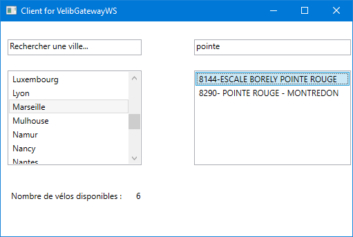

# SOAP Middleware Service and Client for JCDecaux API

## Features

* Client
  * Displays the number of bikes available of the currently selected station **[MVP]**.
  * WPF client instead of a console one **[Extension Development #1]**.
  * Search bars for cities and stations.

* Server
  * All requests between the service and the API and between the service and the client are asynchronous **[Extension Development #2]**.
  * The service uses caching to reduce communications with the API **[Extension Development #3]**.

## How to use :

* Open the solution `Velib_Gateway_WS.sln` in the `Velib_Gateway_WS` folder
* For the console client :
  * Set `ConsoleClientForVelibGatewayWS` as startup project
  * Just launch it, it should launch the server with it.
  * A console should appear, type `help` to see the available commands.
  * Type `getcities` to get the available cities, `getstations <city>` to get the stations names for a city, and `getbikes <stationName>` to get the available bikes for a station. For the last command you can type a part of the name, the service should find the corresponding station.
  * To close the client, you can type `exit`.
* For the WPF Client :
  * Set `WPFClientForVelibGateway` as startup project
  * Just launch it, it should launch the server with it.
  * The UI should be intuitive enough. (See screenshot below)

## WPF Client Screenshot

## To Improve

* Caching could have been made using C# classes (example [here](https://codeshare.co.uk/blog/simple-reusable-net-caching-example-code-in-c/)).
* Caching uses arbitrary values that might not be optimal ones, currently the stations data are invalidated after 5 minutes and the cities data after 1 hour.